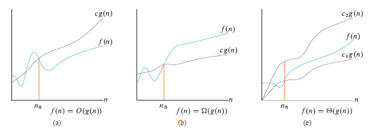

# Asymptotic Notations

> Asymptotic = approaching a limiting behaviour or value but never exactly reaching it

### Notiations
1. Big O | $ O $
    - Upper Bound | $ \le $
2. Big Omega | $ \Omega $
    - Lower Bound | $ \ge $
3. Big Theta | $ \Theta $

### $O(n)$ | Upper bound
- Always onsider less than or equal to
- But with the following conditions
    - It's $\le$ beyond some point ($N_o$)

- $g(n)$ overtakes $f(n)$ and stays overtaken
- Constant factors must be disregarded, i.e., we can give a little push to $g(n)$ by providing a constant $K$ so that it overtakes $f(n)$
- So mathematically, 
    - $f(n)$ is asymptotically upper bound by $g(n)$, when $K>0$, $N_o >0$ and $N >  N_o$

### $\Omega (n)$ | Lower bound